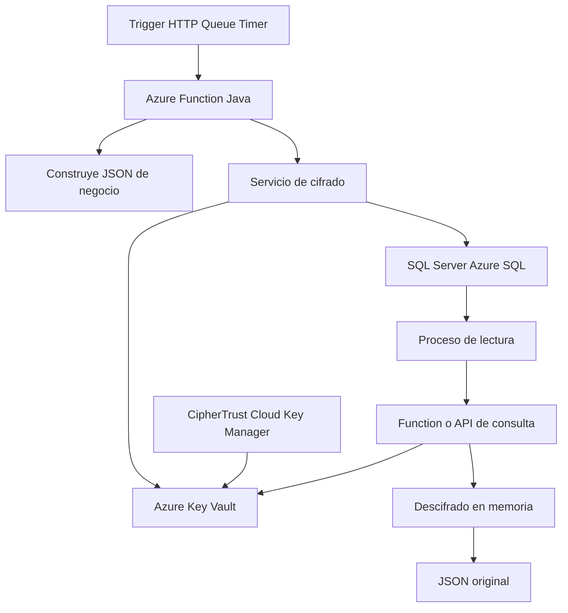
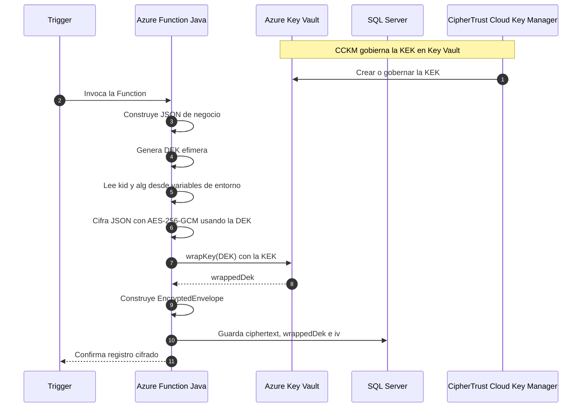
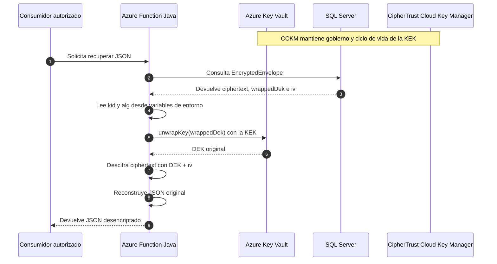

# PoC: Azure Function + CipherTrust Cloud Key Manager + Azure Key Vault + SQL Server

Compatibilidad objetivo:

- `Java 11`

## 1. Objetivo de la PoC

Validar una arquitectura PoC controlada donde una `Azure Function` en Java:

- genera una estructura `JSON`,
- la cifra usando `AES-256-GCM`,
- guarda el resultado en `SQL Server` dentro de una columna `nvarchar(max)`,
- y posteriormente puede recuperar y descifrar ese contenido.

La PoC mantiene gobierno de llaves con `CipherTrust Cloud Key Manager` y operacion criptografica con `Azure Key Vault`.

Supuesto clave de esta PoC:

- solo existe un consumidor autorizado del dato cifrado,
- `kid` y `alg` se resuelven desde variables de entorno de la `Azure Function`,
- el payload persistido se mantiene simplificado.

## 2. Alcance de la PoC

La PoC cubre:

- generacion de `JSON` de negocio,
- cifrado simetrico con `DEK` efimera,
- proteccion de la `DEK` con `KEK` en `Azure Key Vault`,
- persistencia del sobre cifrado en `SQL Server`,
- descifrado posterior usando `unwrapKey`.

La PoC no cubre:

- hardening completo de infraestructura,
- automatizacion CI/CD,
- observabilidad corporativa completa,
- rotacion automatica de KEK en produccion.

## 3. Arquitectura objetivo de la PoC



## 4. Componentes

### 4.1 Azure Function Java

Responsabilidades:

- construir el `JSON` de negocio,
- invocar la libreria de cifrado,
- persistir el sobre cifrado en SQL,
- recuperar y descifrar cuando sea requerido.

Autenticacion recomendada:

- `Managed Identity` en Azure.

### 4.2 Azure Key Vault

Responsabilidades:

- custodiar la `KEK`,
- hacer `wrapKey` y `unwrapKey`,
- mantener versionado de llave.

### 4.3 CipherTrust Cloud Key Manager

Responsabilidades:

- gobernar ciclo de vida de la llave,
- inventario,
- auditoria,
- cumplimiento,
- alineacion de politicas entre ambientes.

### 4.4 SQL Server / Azure SQL

Responsabilidades:

- almacenar el sobre cifrado en `nvarchar(max)`,
- exponer lectura/escritura a la Function,
- mantener trazabilidad funcional del registro.

## 5. Como funciona la llave en esta PoC

Se usan dos llaves:

- `DEK`: cifra el `JSON`.
- `KEK`: protege la `DEK`.

Flujo:

1. La Function genera una `DEK` aleatoria.
2. La Function cifra el `JSON` con `AES-256-GCM`.
3. La Function llama a `Key Vault` para envolver la `DEK`.
4. Guarda en SQL un sobre cifrado con:
   - `ciphertext`
   - `wrappedDek`
   - `iv`
5. Para descifrar:
   - lee el sobre,
   - toma `kid` desde configuracion,
   - toma `alg` desde configuracion,
   - hace `unwrapKey`,
   - recupera la `DEK`,
   - descifra el `JSON`.

## 6. Modelo de persistencia recomendado

## 6.1 Opcion recomendada para la PoC

Guardar un solo sobre JSON serializado dentro de una columna `nvarchar(max)`.

Para esta PoC de un solo consumidor, el payload persistido se simplifica y no incluye `kid` ni `alg` dentro del registro.

Ejemplo:

```json
{
  "ciphertext": "BASE64_CIPHERTEXT",
  "wrappedDek": "BASE64_WRAPPED_DEK",
  "iv": "BASE64_IV"
}
```

## 6.2 Tabla SQL sugerida

```sql
CREATE TABLE dbo.EncryptedJsonStore (
    Id UNIQUEIDENTIFIER NOT NULL PRIMARY KEY,
    BusinessId NVARCHAR(100) NOT NULL,
    EncryptedEnvelope NVARCHAR(MAX) NOT NULL,
    Status NVARCHAR(30) NOT NULL,
    CreatedAtUtc DATETIME2 NOT NULL,
    UpdatedAtUtc DATETIME2 NULL
);
```

## 6.3 Por que una sola columna `nvarchar(max)` funciona bien

- encapsula el contenido cifrado minimo necesario,
- simplifica la PoC,
- evita perder `iv`,
- permite mover el registro sin reconstruir multiples columnas.

## 6.4 Metadatos criptograficos externalizados en configuracion

Para esta PoC, la `Azure Function` obtiene desde variables de entorno:

- `AZURE_KEY_ID`
- `ENCRYPTION_ALGORITHM`

Ejemplo:

```text
AZURE_KEY_ID=https://mi-kv.vault.azure.net/keys/kek-func-poc/123456
ENCRYPTION_ALGORITHM=AES-256-GCM
```

Esta simplificacion es aceptable porque:

- solo existe un consumidor,
- el flujo de cifrado y descifrado esta controlado por la misma solucion,
- no se busca interoperabilidad entre multiples sistemas en esta fase.

## 7. Flujo end-to-end de la PoC

## 7.1 Flujo de cifrado

1. Un trigger activa la `Azure Function`.
2. La Function arma el `JSON`.
3. La Function serializa el objeto a `String`.
4. Genera una `DEK` aleatoria.
5. Cifra el contenido con `AES-256-GCM`.
6. Pide a `Azure Key Vault` `wrapKey` de la `DEK`.
7. Construye el `EncryptedEnvelope`.
8. Serializa el sobre a JSON.
9. Guarda ese JSON en `EncryptedEnvelope` de SQL.

## 7.2 Flujo de descifrado

1. Un proceso autorizado consulta SQL.
2. Recupera el contenido de `EncryptedEnvelope`.
3. Lo deserializa.
4. Lee `kid` y `alg` desde variables de entorno.
5. Llama a `Key Vault` usando `wrappedDek`.
6. Recupera la `DEK`.
7. Usa `iv` para descifrar con `AES-256-GCM`.
8. Reconstruye el `JSON` original.

## 8. Diagramas de secuencia

## 8.1 Secuencia de encriptacion



## 8.2 Explicacion paso a paso de la encriptacion

1. `CipherTrust Cloud Key Manager` gobierna la `KEK` que vive en `Azure Key Vault`.
2. Un `trigger` activa la `Azure Function`.
3. La Function construye el `JSON` de negocio.
4. La Function genera una `DEK` efimera que se usara solo para ese contenido.
5. La Function toma `kid` y `alg` desde variables de entorno.
6. La Function cifra el `JSON` con `AES-256-GCM`.
7. La Function envia la `DEK` a `Azure Key Vault` para hacer `wrapKey`.
8. `Azure Key Vault` devuelve el `wrappedDek`.
9. La Function construye un payload simplificado con `ciphertext`, `wrappedDek` e `iv`.
10. La Function serializa ese payload y lo guarda en `SQL Server`.

## 8.3 Secuencia de desencriptacion



## 8.4 Explicacion paso a paso de la desencriptacion

1. El consumidor autorizado solicita recuperar el contenido.
2. La `Azure Function` consulta el registro en `SQL Server`.
3. SQL devuelve el payload con `ciphertext`, `wrappedDek` e `iv`.
4. La Function toma `kid` y `alg` desde variables de entorno.
5. La Function envia `wrappedDek` a `Azure Key Vault` mediante `unwrapKey`.
6. `Azure Key Vault` devuelve la `DEK` original.
7. La Function usa la `DEK` y el `iv` para descifrar el `ciphertext`.
8. La Function reconstruye el `JSON` original y lo entrega al consumidor autorizado.

## 9. Decisiones de arquitectura

### 9.1 Por que no guardar solo `wrappedDek` e `iv`

Porque sin `ciphertext` no existe contenido para descifrar.

### 9.2 Por que no persistir `kid` y `alg` en esta PoC

Porque la PoC tiene un solo consumidor y ambos valores se controlan desde configuracion centralizada de la Function.

### 9.3 Por que `AES-256-GCM`

Porque entrega:

- confidencialidad,
- integridad,
- autenticidad del contenido cifrado.

### 9.4 Por que `Managed Identity`

Porque evita secretos embebidos y permite control RBAC nativo.

### 9.5 Por que `CCKM + Key Vault`

- `Key Vault` resuelve la operacion criptografica cloud-native.
- `CCKM` resuelve gobierno, visibilidad y cumplimiento.

## 10. Riesgos controlados por el diseno

- Exposicion de una llave fija en codigo.
- Imposibilidad de descifrar por falta de `iv`.
- Persistencia de la `DEK` en claro.
- Falta de separacion entre dato cifrado y llave de proteccion.

## 11. Riesgos que siguen existiendo en PoC

- Si `Key Vault` no esta disponible, no hay `unwrap`.
- Si cambia la configuracion de `kid` sin control, podria romper la lectura de datos historicos.
- Si el usuario o proceso no autorizado puede invocar la Function de lectura, el dato podria exponerse.
- Si se registran logs con payloads sensibles, se rompe la confidencialidad.
- Si se reutiliza `iv`, se debilita el esquema criptografico.

## 12. Controles minimos para aprobar la PoC

- `Managed Identity` habilitada.
- Permisos minimos:
  - `wrapKey`
  - `unwrapKey`
- `KEK` dedicada para la PoC.
- `AZURE_KEY_ID` controlado por ambiente.
- `ENCRYPTION_ALGORITHM=AES-256-GCM`.
- no registrar `ciphertext`, `wrappedDek` o payload sensible en logs.
- limpiar buffers de llave cuando sea posible.

## 13. Estructura de codigo sugerida

```text
src/main/java/com/empresa/security/poc/
  model/
    EncryptedEnvelope.java
  crypto/
    EnvelopeEncryptionService.java
  function/
    EncryptJsonFunctionExample.java
    DecryptJsonFunctionExample.java
```

Nota de compatibilidad:

- evitar `record`
- evitar text blocks `"""`
- usar clases Java tradicionales y getters para compatibilidad con `Java 11`

## 14. Flujo de presentacion para stakeholders

Mensaje ejecutivo:

- La Function no guarda datos sensibles en claro.
- La llave que cifra el contenido no queda persistida.
- `Key Vault` protege la llave de datos.
- `CipherTrust` gobierna la llave maestra.
- SQL almacena un payload cifrado simplificado y suficiente para esta PoC.
- `kid` y `alg` se controlan desde configuracion porque existe un unico consumidor.

## 15. Siguiente paso recomendado

Despues de esta PoC, el siguiente nivel natural es construir:

- la `Azure Function` completa,
- integracion JDBC con SQL Server,
- serializacion JSON real,
- endpoints o triggers de lectura,
- evolucion del payload para incluir `kid`, `alg` y `ver` si aparecen nuevos consumidores,
- pruebas de rotacion y resiliencia.
