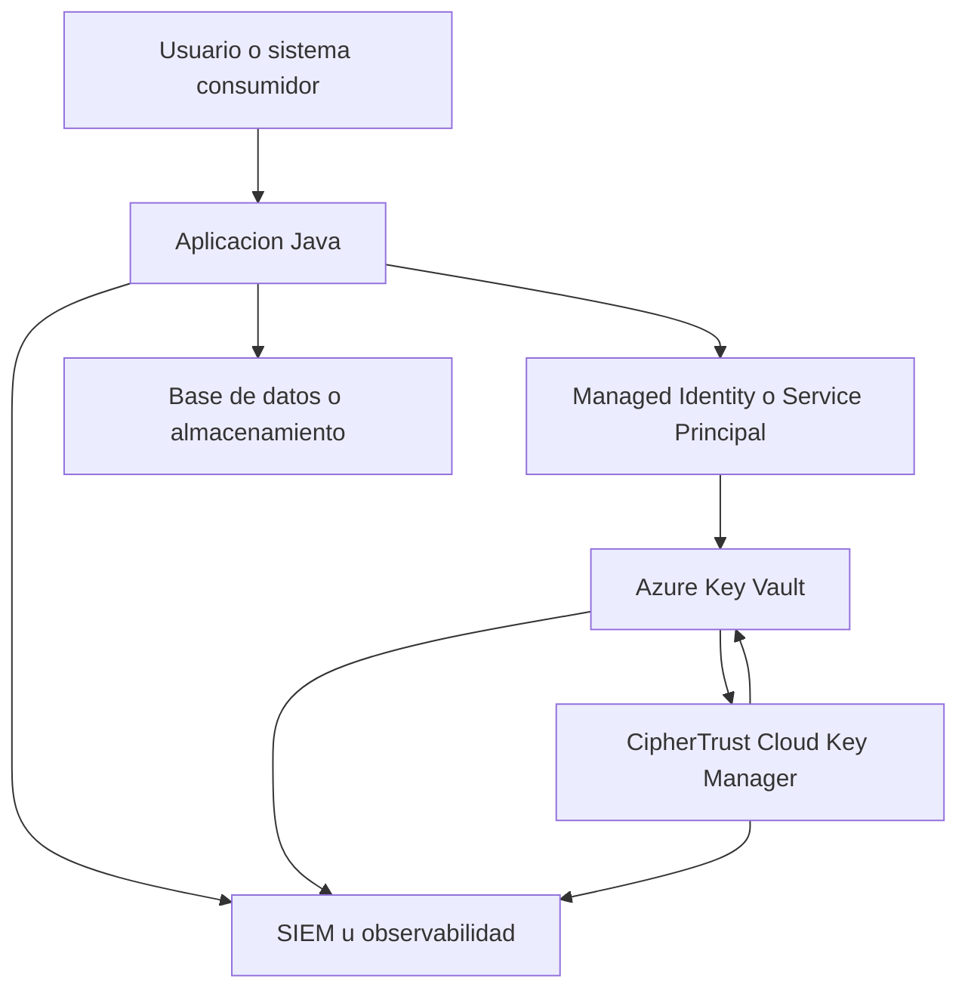
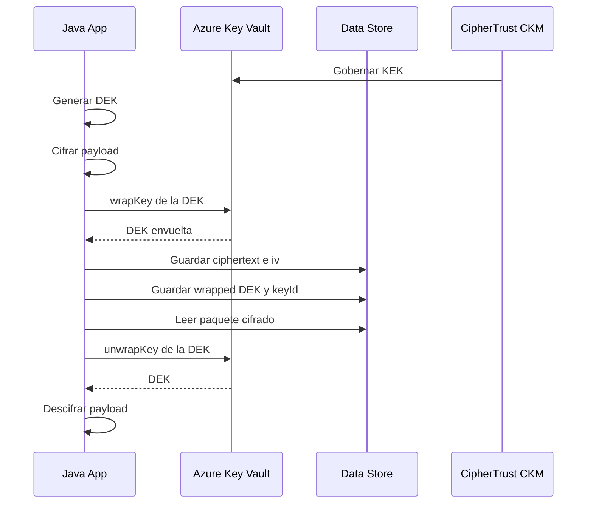

# Arquitectura de Encriptacion Simetrica con CipherTrust Cloud Key Manager + Key Vault + Java

## 1. Objetivo

Disenar una arquitectura de cifrado simetrico empresarial para aplicaciones Java donde:

- La aplicacion cifra y descifra datos sensibles usando `AES-256-GCM`.
- Las llaves de cifrado de datos no se exponen de forma permanente en codigo ni configuracion.
- La raiz de confianza y el ciclo de vida de llaves quedan centralizados.
- La solucion sea escalable para microservicios, servicios batch y APIs.

Esta propuesta usa:

- `CipherTrust Cloud Key Manager (CCKM)` como plano centralizado de gobierno y ciclo de vida de llaves.
- `Azure Key Vault` como proveedor de llaves/KMS operativo para integracion cloud-native.
- `Java` como consumidor de cifrado mediante un patron de `envelope encryption`.

## 2. Principios de diseno

- Separacion estricta entre datos, llaves y politicas.
- Uso de `envelope encryption` para reducir exposicion de llaves maestras.
- Cifrado autenticado por defecto con `AES/GCM/NoPadding`.
- Rotacion de llaves sin recifrar toda la data historica de inmediato.
- Trazabilidad completa de operaciones criptograficas.
- Minimo privilegio para identidades, secretos y permisos de uso de llave.

## 3. Arquitectura objetivo



## 4. Roles de cada componente

### 4.1 Aplicacion Java

Responsabilidades:

- Generar una `DEK` (`Data Encryption Key`) efimera por objeto, registro, archivo o lote.
- Cifrar la carga util usando `AES-256-GCM`.
- Solicitar a `Azure Key Vault` el wrap/unwrap de la DEK usando una `KEK` (`Key Encryption Key`).
- Persistir solamente:
  - el dato cifrado,
  - el `iv/nonce`,
  - el `wrapped DEK`,
  - el `key version id`,
  - metadatos de algoritmo y version.

La aplicacion nunca debe persistir la DEK en claro.

### 4.2 Azure Key Vault

Responsabilidades:

- Custodiar la `KEK`.
- Ejecutar operaciones de `wrapKey` y `unwrapKey`.
- Proveer versionado y rotacion de llaves.
- Integrarse de forma nativa con identidades administradas y controles RBAC.

### 4.3 CipherTrust Cloud Key Manager

Responsabilidades:

- Gobernar el ciclo de vida de llaves multicloud.
- Centralizar inventario, politicas, visibilidad y cumplimiento.
- Orquestar onboarding y administracion de llaves en `Key Vault`.
- Proveer consistencia operativa y trazabilidad a nivel corporativo.

### 4.4 Almacenamiento de datos

Puede ser:

- `Azure SQL`
- `Cosmos DB`
- `Blob Storage`
- `PostgreSQL`
- `Kafka` con payload cifrado

El almacenamiento solo recibe material cifrado y metadatos no sensibles.

## 5. Patron criptografico recomendado

## 5.1 Envelope encryption

Para cada unidad de informacion sensible:

1. La aplicacion genera una `DEK` aleatoria de 256 bits.
2. La aplicacion cifra el payload con `AES-256-GCM`.
3. La aplicacion envia la DEK a `Key Vault` para `wrap` con la `KEK`.
4. La aplicacion descarta la DEK en memoria al terminar.
5. Se persiste el payload cifrado junto con el `wrapped DEK`.

Para descifrar:

1. La aplicacion lee payload, `wrapped DEK`, `iv`, `tag` y `key version`.
2. Solicita a `Key Vault` `unwrap` de la DEK.
3. Descifra usando `AES-256-GCM`.
4. Borra la DEK de memoria lo antes posible.

## 5.2 Algoritmos

Recomendado:

- Cifrado de datos: `AES-256-GCM`
- Longitud de IV: `12 bytes`
- Authentication tag: `128 bits`
- Wrap de DEK con KEK en Key Vault:
  - `RSA-OAEP-256` si la KEK es RSA
  - `A256KW` si se usa una llave simetrica compatible en el proveedor

En la mayoria de despliegues con `Azure Key Vault`, `RSA-OAEP-256` es una opcion operativa comun para wrap/unwrap de la DEK.

## 6. Flujo operacional end-to-end

### 6.1 Flujo de provisionamiento

1. Seguridad crea o registra la llave maestra en `CipherTrust Cloud Key Manager`.
2. `CCKM` administra la presencia/ciclo de vida de la llave en `Azure Key Vault`.
3. Se define naming estandar:
   - `kek-appname-prod`
   - `kek-appname-qa`
   - `kek-domain-pii`
4. Se habilita rotacion y versionado.
5. Se asignan permisos de `wrapKey` y `unwrapKey` a la identidad de la aplicacion.

### 6.2 Flujo de cifrado

1. La app obtiene identidad federada o `Managed Identity`.
2. La app invoca `Key Vault` usando SDK oficial.
3. Genera DEK efimera localmente.
4. Cifra el dato.
5. Hace `wrapKey` de la DEK con la KEK.
6. Guarda el paquete cifrado.

### 6.3 Flujo de descifrado

1. La app recupera el paquete cifrado.
2. Usa el `keyId` versionado para `unwrapKey`.
3. Reconstruye la DEK solo en memoria.
4. Descifra el payload.
5. Registra auditoria funcional.

## 7. Modelo de datos recomendado

Ejemplo de objeto persistido:

```json
{
  "ciphertext": "BASE64(...)",
  "wrappedDek": "BASE64(...)",
  "iv": "BASE64(...)",
  "tagLengthBits": 128,
  "algorithm": "AES-256-GCM",
  "kekKeyId": "https://mi-kv.vault.azure.net/keys/kek-app-prod/<version>",
  "createdAt": "2026-04-21T10:15:00Z",
  "schemaVersion": "1"
}
```

## 8. Arquitectura logica por capas

```text
[Capa de aplicacion]
  Servicios Java / APIs / Jobs

[Capa criptografica]
  CryptoService
  DekGenerator
  PayloadEncryptor
  KeyWrapService

[Capa de integracion]
  Azure Key Vault SDK
  Identity SDK

[Capa de gobierno]
  CipherTrust Cloud Key Manager
  Politicas de rotacion
  Inventario y auditoria

[Capa de persistencia]
  DB / Blob / Cola / Data Lake
```

## 9. Diseno recomendado para Java

Separar responsabilidades:

- `EncryptionService`
  - `encrypt(byte[] plaintext, byte[] aad)`
  - `decrypt(EncryptedPackage pkg, byte[] aad)`
- `KeyManagementService`
  - `wrapDek(byte[] dek)`
  - `unwrapDek(byte[] wrappedDek, String keyId)`
- `DekGenerator`
  - `generateAes256Key()`
- `CryptoMetadata`
  - algoritmo
  - version
  - keyId
  - fecha

## 10. Integracion Java recomendada

Dependencias base:

- `com.azure:azure-security-keyvault-keys`
- `com.azure:azure-identity`

Patrones de autenticacion:

- Produccion en Azure: `ManagedIdentityCredential`
- CI/CD o integracion controlada: `ClientSecretCredential`
- Desarrollo local: `DefaultAzureCredential`

## 11. Ejemplo de secuencia tecnica



## 12. Seguridad y controles obligatorios

### 12.1 Identidad y acceso

- Usar identidades administradas siempre que sea posible.
- Prohibir secretos embebidos en `application.properties`.
- Permisos minimos en Key Vault:
  - `wrapKey`
  - `unwrapKey`
  - opcionalmente `get` para metadatos de version
- Separar roles de:
  - administracion de llaves,
  - uso criptografico,
  - auditoria.

### 12.2 Seguridad en memoria

- Mantener DEK solo en memoria volatil.
- Sobrescribir arreglos de bytes cuando sea factible.
- Evitar logs con payloads, DEKs o errores verbosos que filtren material criptografico.

### 12.3 Rotacion

- Rotar la `KEK` periodicamente.
- El payload historico puede conservar el `wrapped DEK` ligado a una version anterior.
- Para nuevos cifrados usar siempre la ultima version activa.
- Si la politica lo exige, ejecutar un proceso de `rewrap` sin descifrar payload:
  - `unwrap` DEK con la version anterior
  - `wrap` DEK con nueva version de KEK

### 12.4 Auditoria

Registrar:

- `who`: identidad de servicio o usuario
- `what`: encrypt, decrypt, wrap, unwrap
- `when`: timestamp UTC
- `which key`: `keyId` y version
- `result`: exito o falla
- `correlationId`

## 13. Alta disponibilidad y resiliencia

- Cachear solo metadatos de llave, no material sensible en claro.
- Implementar reintentos exponenciales para `Key Vault`.
- Definir timeout corto para operaciones KMS.
- Preparar fallback de lectura solo si el negocio lo permite.
- Escalar horizontalmente la app sin dependencia de estado local.

Consideracion importante:

Si `Key Vault` no esta disponible, la app no podra descifrar ni envolver nuevas DEKs. Esto debe tratarse como una dependencia critica de seguridad.

## 14. Ambientes y segregacion

Separar por ambiente:

- `dev`
- `qa`
- `stg`
- `prod`

Nunca compartir la misma `KEK` entre ambientes.

Separar por dominio de datos cuando aplique:

- `PII`
- `financiero`
- `credenciales`
- `documentos`

## 15. Anti-patrones a evitar

- Usar una sola llave simetrica fija en variables de entorno para toda la aplicacion.
- Guardar la llave de datos cifrando directamente en base64 sin wrap.
- Reutilizar IVs con `AES-GCM`.
- Cifrar con `AES-ECB` o `CBC` sin autenticacion.
- Dar permisos de administrador de Key Vault a la aplicacion.
- Acoplar el codigo de negocio a detalles del proveedor KMS.

## 16. Recomendacion de arquitectura empresarial

### Opcion recomendada

- `CipherTrust Cloud Key Manager` como capa de gobierno corporativo.
- `Azure Key Vault` como KMS operativo donde reside la `KEK`.
- `Java` implementando `envelope encryption` con `AES-256-GCM`.
- Persistencia de paquetes cifrados con metadatos versionados.
- Observabilidad centralizada en `SIEM`.

Esta combinacion ofrece:

- control corporativo,
- operacion cloud-native,
- desacoplamiento razonable,
- rotacion manejable,
- cumplimiento y trazabilidad.

## 17. Estructura sugerida del proyecto Java

```text
src/main/java/com/empresa/security/
  config/
    KeyVaultConfig.java
  crypto/
    EncryptionService.java
    AesGcmCryptoService.java
    DekGenerator.java
    EncryptedPackage.java
  kms/
    KeyManagementService.java
    AzureKeyVaultKeyManagementService.java
  application/
    SensitiveDataApplicationService.java
```

## 18. Roadmap de implementacion

1. Definir clasificacion de datos y casos de uso.
2. Crear modelo de llaves por dominio y ambiente.
3. Configurar `CCKM` y `Azure Key Vault`.
4. Implementar libreria Java reutilizable de cifrado.
5. Integrar auditoria y observabilidad.
6. Ejecutar pruebas de:
   - rotacion,
   - resiliencia,
   - rendimiento,
   - recuperacion,
   - cumplimiento.

## 19. Conclusion ejecutiva

La mejor practica para este escenario no es cifrar directamente con una llave guardada en la aplicacion, sino usar `envelope encryption`:

- `Java` cifra los datos con una `DEK` efimera.
- `Azure Key Vault` protege la `DEK` mediante una `KEK`.
- `CipherTrust Cloud Key Manager` gobierna el ciclo de vida, inventario, cumplimiento y politicas de las llaves.

Ese enfoque reduce riesgo operativo, mejora trazabilidad y habilita una arquitectura lista para escala empresarial.
